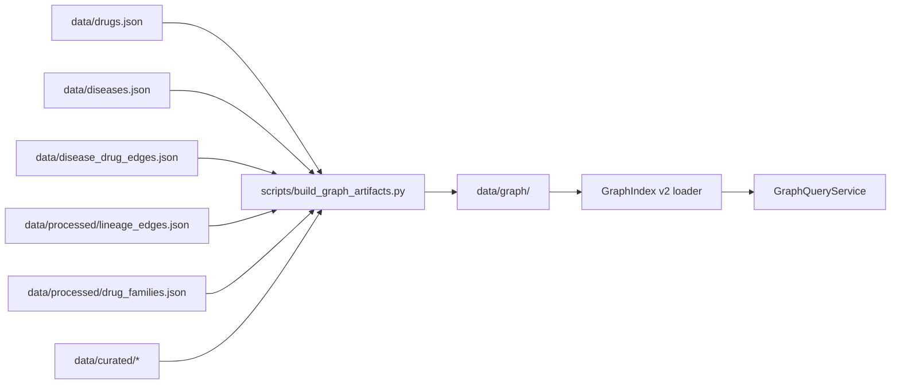

# Graph Data Contract

Canonical file layout, edge metadata contract, and migration map for DrugTree's graph-native v2 data layer.

> **Status**: Planning — no files created under `data/graph/`. This document specifies the target layout.
> **Depends on**: [graph-schema.md](./graph-schema.md), [lineage-model.md](./lineage-model.md), [disease-model.md](./disease-model.md)

---

## 1. Current Canonical Source Map

| File | Role | Graph Contribution |
|------|------|--------------------|
| `data/drugs.json` | 7,359 drug records (30+ fields each) | Drug nodes (`drug:*`) — names, SMILES, ATC, targets, body_region, source IDs |
| `data/diseases.json` | 50 disease records with metadata | Disease nodes (`disease:*`) — prevalence, ontology IDs, mechanism |
| `data/disease_drug_edges.json` | Drug↔disease relationships (457 edges) | `disease_drug` edges — indication_type, evidence_level, confidence |
| `data/processed/drug_families.json` | 26 drug families | `cluster` nodes + `family_member` edges (currently implicit via `member_drug_ids[]`) |
| `data/processed/lineage_edges.json` | 50 lineage edges | `lineage` edges — edge_type, confidence, score_breakdown, provenance |
| `data/ontology/body-ontology.json` | 14 body region definitions | Node `body_region` field resolution — no edges produced |

---

## 2. Proposed `data/graph/` Layout

```
data/graph/
├── nodes/
│   ├── drugs.json          # Drug nodes with namespace-prefixed IDs
│   ├── diseases.json       # Disease nodes
│   └── targets.json        # Target nodes (🧪 PLANNED)
├── edges/
│   ├── lineage.json        # Drug→drug lineage edges
│   ├── disease_drug.json   # Disease→drug indication edges
│   ├── drug_target.json    # Drug→target edges (🧪 PLANNED)
│   └── family_member.json  # Cluster→drug membership edges
└── graph-meta.json         # Schema version, generation timestamp, stats
```

### 2.1 Node Files

**`nodes/drugs.json`** — one entry per drug, keyed by namespace ID:

**`nodes/drugs.json`** — wraps `Drug` model in `GraphNodeRef` envelope:
```json
{ "schema_version": "2.0.0", "total": 7359, "nodes": [
  { "node_id": "drug:atorvastatin", "node_type": "drug", "label": "Atorvastatin",
    "extra": { "smiles": "CC(C)OC(=O)...", "atc_code": "C10AA05", "atc_category": "C",
               "body_region": "heart_vascular", "chembl_id": "CHEMBL1487", "phase": "IV" } }
] }
```

**`nodes/diseases.json`** — mirrors `Disease` model ([disease-model.md §2](./disease-model.md#2-disease-model)):
```json
{ "schema_version": "2.0.0", "total": 50, "nodes": [
  { "node_id": "disease:glioma", "node_type": "disease", "label": "Glioma",
    "extra": { "body_region": "brain_cns", "prevalence_tier": "uncommon",
               "orphan_flag": false, "icd10_code": "C71.9" } }
] }
```

**`nodes/targets.json`** 🧪 — mirrors `Target` model ([disease-model.md §3](./disease-model.md#3-target-model)). Schema identical; `total: 0` until target extraction is implemented.

### 2.2 Edge Files

Each edge file carries a uniform envelope plus type-specific fields.

**`edges/lineage.json`** — mirrors `LineageEdge` ([lineage-model.md §3](./lineage-model.md#3-lineageedge-schema)):

```json
{
  "schema_version": "2.0.0",
  "total": 50,
  "edges": [
    {
      "edge_id": "omeprazole_to_lansoprazole",
      "edge_type": "lineage",
      "source_id": "drug:omeprazole",
      "target_id": "drug:lansoprazole",
      "confidence": 0.843,
      "lineage_type": "follow_on",
      "provenance": "auto",
      "score_breakdown": { "chronology_score": 1.0, "mechanism_score": 1.0, "scaffold_score": 0.478 },
      "generation_rationale": ["same_target", "similar_scaffold"],
      "source": "chembl",
      "source_record_id": null,
      "curation_status": "auto_validated",
      "updated_at": "2025-01-15T10:30:00Z"
    }
  ]
}
```

**`edges/disease_drug.json`** — mirrors `DrugDiseaseEdge` ([disease-model.md §4](./disease-model.md#4-drug-disease-edge-model)):

```json
{
  "schema_version": "2.0.0",
  "total": 457,
  "edges": [
    {
      "edge_id": "disease:epilepsy_drug:carbamazepine",
      "edge_type": "disease_drug",
      "source_id": "disease:epilepsy",
      "target_id": "drug:carbamazepine",
      "confidence": 1.0,
      "indication_type": "primary",
      "evidence_source": "curated_seed",
      "evidence_level": "approved",
      "phase_context": null,
      "source": "curated_seed",
      "source_record_id": null,
      "curation_status": "curated",
      "updated_at": "2025-01-15T10:30:00Z"
    }
  ]
}
```

**`edges/drug_target.json`** 🧪 — derived from drug `targets[]` field:

```json
{
  "schema_version": "2.0.0",
  "total": 0,
  "edges": []
}
```

**`edges/family_member.json`** — extracted from `DrugFamily.member_drug_ids[]`:

```json
{
  "schema_version": "2.0.0",
  "total": 85,
  "edges": [
    {
      "edge_id": "cluster:target_hmg_coa_reductase_7169b791_member:atorvastatin",
      "edge_type": "family_member",
      "source_id": "cluster:target_hmg_coa_reductase_7169b791",
      "target_id": "drug:atorvastatin",
      "confidence": 1.0,
      "family_basis": "target",
      "is_prototype": false,
      "source": "etl_family_builder",
      "source_record_id": "target_hmg_coa_reductase_7169b791",
      "curation_status": "auto_validated",
      "updated_at": "2025-01-15T10:30:00Z"
    }
  ]
}
```

### 2.3 Metadata

**`graph-meta.json`**:

```json
{
  "schema_version": "2.0.0",
  "generated_at": "2025-01-15T10:30:00Z",
  "generator": "scripts/build_graph_artifacts.py",
  "stats": {
    "nodes": { "drug": 7359, "disease": 50, "target": 0, "cluster": 26 },
    "edges": { "lineage": 50, "disease_drug": 457, "drug_target": 0, "family_member": 85 }
  },
  "source_files": {
    "drugs.json": "sha256:abc123...",
    "diseases.json": "sha256:def456...",
    "disease_drug_edges.json": "sha256:ghi789...",
    "processed/drug_families.json": "sha256:jkl012...",
    "processed/lineage_edges.json": "sha256:mno345..."
  }
}
```

---

## 3. Edge Metadata Contract

Every edge in every file under `edges/` MUST carry these **unified fields**:

| Field | Type | Required | Description |
|-------|------|----------|-------------|
| `source` | `string` | ✅ | Data source that produced this edge (e.g., `"chembl"`, `"kegg"`, `"curated_seed"`, `"etl_family_builder"`, `"manual"`) |
| `source_record_id` | `string\|null` | ✅ | Original record ID in the source system (null if generated/derived) |
| `curation_status` | `enum` | ✅ | One of: `"raw"`, `"auto_validated"`, `"curated"`, `"manual"` |
| `updated_at` | `string` | ✅ | ISO 8601 timestamp of last update |
| `confidence` | `float` | ✅ | Composite score [0.0–1.0] |

### Edge-Type-Specific Required Fields

| Edge Type | Required Extra Fields | Source Model |
|-----------|-----------------------|--------------|
| `lineage` | `lineage_type`, `provenance`, `score_breakdown`, `generation_rationale` | [LineageEdge](./lineage-model.md#3-lineageedge-schema) |
| `disease_drug` | `indication_type`, `evidence_source`, `evidence_level` | [DrugDiseaseEdge](./disease-model.md#4-drug-disease-edge-model) |
| `drug_target` 🧪 | `modality`, `action_type` | Target model ([disease-model.md §3](./disease-model.md#3-target-model)) |
| `family_member` | `family_basis`, `is_prototype` | DrugFamily model (`src/backend/models/drug_family.py`) |

### Curation Status Progression

```
raw → auto_validated → curated → manual
```

- **raw**: Direct ETL output, no validation
- **auto_validated**: Passed schema + DAG validation (`dag_validator.py`)
- **curated**: Reviewed via `data/curated/` overrides
- **manual**: Directly entered by domain expert (highest precedence)

---

## 4. Migration Map

| Current File | → Future Graph Artifact | Transformation |
|--------------|------------------------|----------------|
| `data/drugs.json` | `data/graph/nodes/drugs.json` | Wrap each drug in `GraphNodeRef` envelope with `node_id: "drug:{id}"` |
| `data/diseases.json` | `data/graph/nodes/diseases.json` | Wrap each disease in `GraphNodeRef` envelope with `node_id: "disease:{id}"` |
| `data/disease_drug_edges.json` | `data/graph/edges/disease_drug.json` | Add `source_id`/`target_id` namespace prefixes + unified metadata fields |
| `data/processed/lineage_edges.json` | `data/graph/edges/lineage.json` | Add namespace prefixes to `from_drug_id`/`to_drug_id`, add `source`/`curation_status`/`updated_at` |
| `data/processed/drug_families.json` | `data/graph/nodes/` (cluster nodes) + `data/graph/edges/family_member.json` | Explode each family into 1 cluster node + N membership edges |
| `data/ontology/body-ontology.json` | **Stays as-is** | Body ontology is config, not graph data; nodes reference `body_region` field |
| `data/curated/*` | **Stays as-is** | Override mechanism continues; merged during graph artifact generation |

---

## 5. Versioning Strategy

- **`schema_version`**: SemVer string (`MAJOR.MINOR.PATCH`) on every file
  - **MAJOR**: Breaking structural change (field removed, type changed)
  - **MINOR**: Additive change (new optional field)
  - **PATCH**: Bug fix in generation logic
- **Current**: `"1.1.0"` (lineage edges, drug families), `"1.0.0"` (disease-drug edges)
- **Target v2**: `"2.0.0"` — unified graph layout with namespace-prefixed IDs and edge metadata contract
- **Backward compatibility**: `GraphIndex` (`src/backend/services/graph_index.py`) reads both legacy (`data/processed/`) and v2 (`data/graph/`) paths; v2 takes precedence when present
- **`graph-meta.json`** carries SHA-256 hashes of all source files for integrity verification

---

## 6. Generation Pipeline



The generator script reads canonical sources, applies curated overrides, validates DAG structure, and writes the `data/graph/` directory. It is the **sole writer** of graph artifacts — no manual edits to `data/graph/`.
