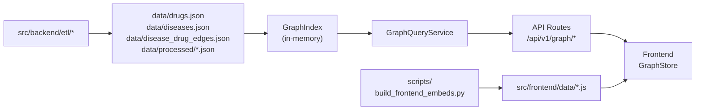

# Graph Schema

Defines DrugTree's unified multi-entity graph: node types, edge types, namespace conventions, query contracts, and the in-memory index architecture.

> **Source of truth**: `src/backend/models/graph.py`, `src/backend/services/graph_index.py`, `src/backend/services/graph_queries.py`

---

## Table of Contents

1. [Namespace Convention](#1-namespace-convention)
2. [Node Types](#2-node-types)
3. [Edge Types](#3-edge-types)
4. [Evidence Model](#4-evidence-model)
5. [Query Contracts](#5-query-contracts)
6. [GraphIndex Architecture](#6-graphindex-architecture)
7. [Data Flow](#7-data-flow)

---

## 1. Namespace Convention

All node IDs use the format `{type}:{slug}` for collision-free identification across entity types.

| Prefix  | Entity   | Example                      |
|---------|----------|------------------------------|
| `drug:` | Drug     | `drug:atorvastatin`          |
| `disease:` | Disease | `disease:glioma`           |
| `target:` | Target | `target:EGFR`              |
| `cluster:` | Family | `cluster:statin`           |

Edge IDs use contextual formats:
- Lineage: `from_drug_id_to_to_drug_id` (e.g., `lovastatin_to_atorvastatin`)
- Disease-drug: `disease:{disease_id}_drug:{drug_id}` (e.g., `disease:glioma_drug:temozolomide`)

---

## 2. Node Types

Four node types are defined in `GraphNodeType` (`src/backend/models/graph.py`):

```python
class GraphNodeType(str, Enum):
    drug = "drug"
    disease = "disease"
    target = "target"
    cluster = "cluster"
```

### 2.1 GraphNodeRef (unified node envelope)

Every node resolved through the query service returns a `GraphNodeRef`:

| Field      | Type             | Required | Description                                  |
|------------|------------------|----------|----------------------------------------------|
| `node_id`  | `str`            | Yes      | Namespaced ID (e.g., `drug:atorvastatin`)    |
| `node_type`| `GraphNodeType`  | Yes      | Node type discriminator                       |
| `label`    | `str`            | Yes      | Human-readable display name                  |
| `extra`    | `dict[str, object]` | No    | Type-specific metadata                        |

### 2.2 Concrete Node Models

Defined in `src/backend/models/nodes.py`:

**DrugNode** — `src/backend/models/drug.py` (full `Drug` model, 30+ fields)
- Key fields: `id`, `name`, `smiles`, `inchikey`, `atc_code`, `atc_category`, `molecular_weight`, `phase`, `generation`, `targets[]`, `body_region`, `family_ids[]`
- Computed: `full_id` = `"drug:{id}"`

**DiseaseNode** — `src/backend/models/disease.py` (full `Disease` model)
- Key fields: `id`, `canonical_name`, `body_region`, `anatomy_nodes[]`, `orphan_flag`, `prevalence_tier`, `target_count`, `approved_drug_count`
- External IDs: `orphanet_id`, `mondo_id`, `doid_id`, `mesh_id`, `efo_id`, `icd10_code`
- Computed: `full_id` = `"disease:{id}"`

**TargetNode** — `src/backend/models/disease.py` (full `Target` model)
- Key fields: `id`, `symbol`, `name`, `modality`, `disease_ids[]`
- External IDs: `uniprot_id`, `hgnc_id`, `entrez_id`
- Computed: `full_id` = `"target:{id}"`

**ClusterNode** — `src/backend/models/drug_family.py` (full `DrugFamily` model)
- Key fields: `family_id`, `label`, `family_basis`, `prototype_drug_id`, `member_drug_ids[]`, `representative_target_ids[]`, `atc_codes[]`
- Computed: `full_id` = `"cluster:{id}"`

---

## 3. Edge Types

Four edge types are defined in `GraphEdgeType` (`src/backend/models/graph.py`):

```python
class GraphEdgeType(str, Enum):
    lineage = "lineage"
    disease_drug = "disease_drug"
    drug_target = "drug_target"
    family_member = "family_member"
```

### 3.1 GraphEdgeRef (unified edge envelope)

| Field         | Type               | Required | Description                              |
|---------------|--------------------|----------|------------------------------------------|
| `edge_id`     | `str`              | Yes      | Unique edge identifier                   |
| `edge_type`   | `GraphEdgeType`    | Yes      | Edge type discriminator                  |
| `source_id`   | `str`              | Yes      | Namespaced source node ID                |
| `target_id`   | `str`              | Yes      | Namespaced target node ID                |
| `confidence`  | `float`            | No       | Confidence score [0.0–1.0], default 1.0  |
| `evidence`    | `list[Evidence]`   | No       | Supporting evidence items                |
| `extra`       | `dict[str, object]`| No       | Type-specific metadata                    |

### 3.2 Edge Type Details

| Edge Type        | Source → Target        | Current Status | Source File                          |
|------------------|------------------------|----------------|--------------------------------------|
| `lineage`        | drug → drug            | Active         | `data/processed/lineage_edges.json`  |
| `disease_drug`   | disease → drug         | Active         | `data/disease_drug_edges.json`       |
| `drug_target`    | drug → target          | Planned        | —                                    |
| `family_member`  | cluster → drug         | Active (via index) | `data/processed/drug_families.json` |

> **Note**: `drug_target` and `family_member` edges are modeled in the graph type system but currently resolved through the `GraphIndex` adjacency structure rather than dedicated edge files.

---

## 4. Evidence Model

Defined in `src/backend/models/graph.py`:

```python
class Evidence(BaseModel):
    source: str                    # Evidence source identifier
    source_type: Literal[          # Source category
        "literature",
        "database",
        "curated",
        "inferred"
    ] = "inferred"
    confidence: float = 1.0        # [0.0–1.0]
    description: Optional[str]     # Human-readable explanation
    url: Optional[str]             # Reference URL
```

Evidence is aggregated per-edge from multiple sources:
- **Lineage edges**: provenance value + score breakdown components
- **Disease-drug edges**: evidence_source + evidence_level + indication_type

---

## 5. Query Contracts

Implemented by `GraphQueryService` (`src/backend/services/graph_queries.py`).

### 5.1 Node Resolution — `GET /api/v1/graph/node/{node_id}`

- Input: namespaced node ID (e.g., `drug:atorvastatin`)
- Output: `GraphNodeRef` or `null`
- Resolution order: parse namespace → dispatch to type-specific resolver

### 5.2 Neighborhood — `GET /api/v1/graph/neighborhood/{node_id}?max_hops=1-5`

- Input: namespaced node ID + max_hops (1–5)
- Output: `NeighborhoodResult`
  - `center_node`: `GraphNodeRef`
  - `edges`: `list[GraphEdgeRef]` (lineage + disease-drug edges within range)
  - `neighbor_nodes`: `list[GraphNodeRef]` (drug + disease nodes)
  - `max_hops_reached`: actual hops explored
- Algorithm: BFS from center drug, includes transitive disease-drug edges
- **Limitation**: Only drug nodes support multi-hop traversal; disease/target/cluster nodes return empty neighborhoods

### 5.3 Evidence — `GET /api/v1/graph/evidence/{edge_id}`

- Input: edge ID (lineage or disease-drug format)
- Output: `list[Evidence]`
- Resolution: checks lineage edges first, then disease-drug edges

### 5.4 Subgraph — `GET /api/v1/graph/subgraph?node_ids=a,b,c`

- Input: comma-separated namespaced node IDs
- Output: `SubgraphResult`
  - `nodes`: `list[GraphNodeRef]`
  - `edges`: `list[GraphEdgeRef]` (lineage + disease-drug within node set)
  - `total_nodes`, `total_edges`: counts

---

## 6. GraphIndex Architecture

Defined in `src/backend/services/graph_index.py`. Singleton accessed via `get_graph_index()`.

### 6.1 Data Sources

| Source | Path | Content |
|--------|------|---------|
| Families | `data/processed/drug_families.json` | Drug family groupings |
| Edges | `data/processed/lineage_edges.json` | Lineage relationships |
| Drug names | `data/drugs.json` | Display names for nodes |

### 6.2 Index Structures

| Structure | Type | Lookup |
|-----------|------|--------|
| `_nodes` | `Dict[str, DrugNode]` | O(1) by drug ID |
| `_edges` | `Dict[str, LineageEdge]` | O(1) by edge ID |
| `_families` | `Dict[str, DrugFamily]` | O(1) by family ID |
| `_edges_by_drug` | `Dict[str, List[str]]` | O(1) edge IDs by drug |
| `_adjacency` | `Dict[str, Set[str]]` | O(1) neighbor drug IDs |

### 6.3 DrugNode Internal Structure

```python
class DrugNode:
    drug_id: str
    name: str
    families: List[str]       # family IDs this drug belongs to
    outgoing_edges: List[str] # edge IDs where this drug is source
    incoming_edges: List[str] # edge IDs where this drug is target
```

### 6.4 Lifecycle

- `load()`: reads all JSON files, builds indexes (called lazily on first access)
- `refresh()`: clears all indexes and reloads from files
- All public methods call `load()` if `_loaded` is False (lazy initialization)

---

## 7. Data Flow



**Pipeline**: Canonical JSON files → GraphIndex (O(1) dict lookups) → GraphQueryService (unified GraphNodeRef/GraphEdgeRef responses) → API routes → Frontend GraphStore.

**Frontend embed path**: `build_frontend_embeds.py` mirrors canonical JSON into `src/frontend/data/*.js` globals. Frontend loads these on `init()` and can also query the backend API when available.
